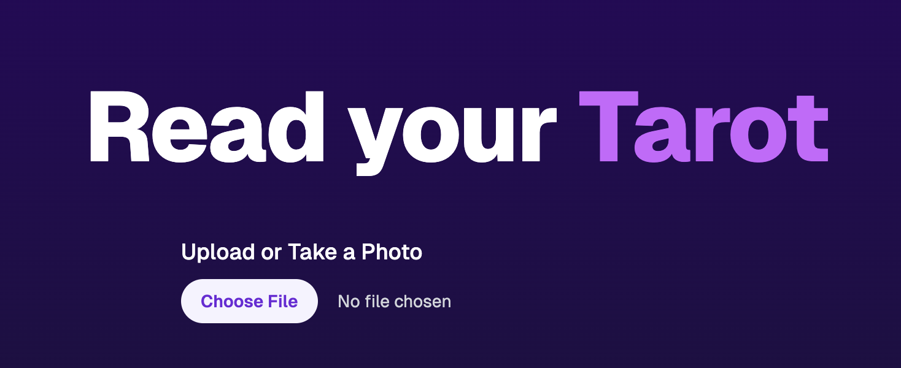

# Tarot Reading App

This is a web application that provides tarot card readings based on uploaded images. It uses the T3 Stack and OpenAI's GPT-4 model for image analysis and reading generation.

## Images
## 

## Features

- Image upload functionality
- AI-powered tarot reading generation
- Responsive design with Tailwind CSS

## Technologies Used

- [Next.js](https://nextjs.org)
- [React](https://reactjs.org)
- [Tailwind CSS](https://tailwindcss.com)
- [OpenAI API](https://openai.com/api/)
- [TypeScript](https://www.typescriptlang.org/)

## Getting Started

1. Clone the repository
2. Install dependencies: `npm install`
3. Set up your OpenAI API key in the environment variables
4. Run the development server: `npm run dev`

## How It Works

1. Users upload an image through the interface
2. The image is sent to the OpenAI API for analysis
3. The API returns a tarot reading based on the image content
4. The reading is displayed to the user

## API Reference

The main API route for generating tarot readings is located at:
